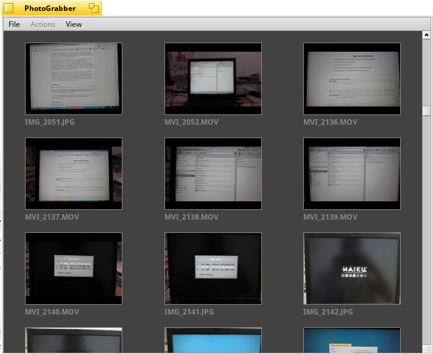

# PhotoGrabber
PhotoGrabber is an application to download/delete pictures from digital cameras and phones.
Currently only PTP (Picture Transfer Protocol) cameras are supported. Mass Storage and Bluetooth may be added in the future.

